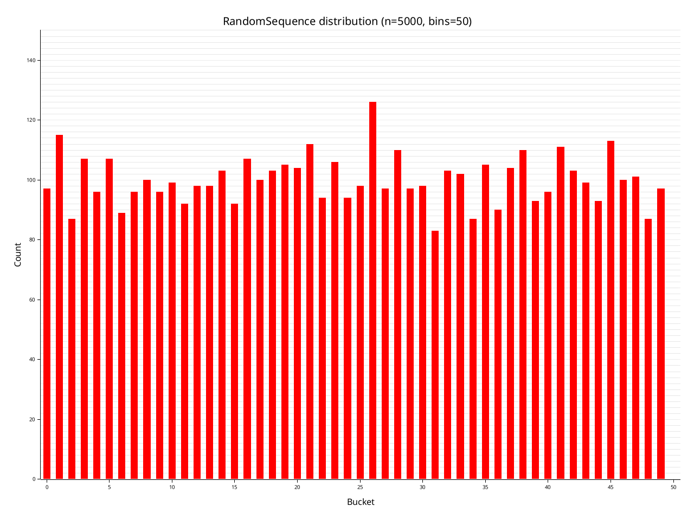
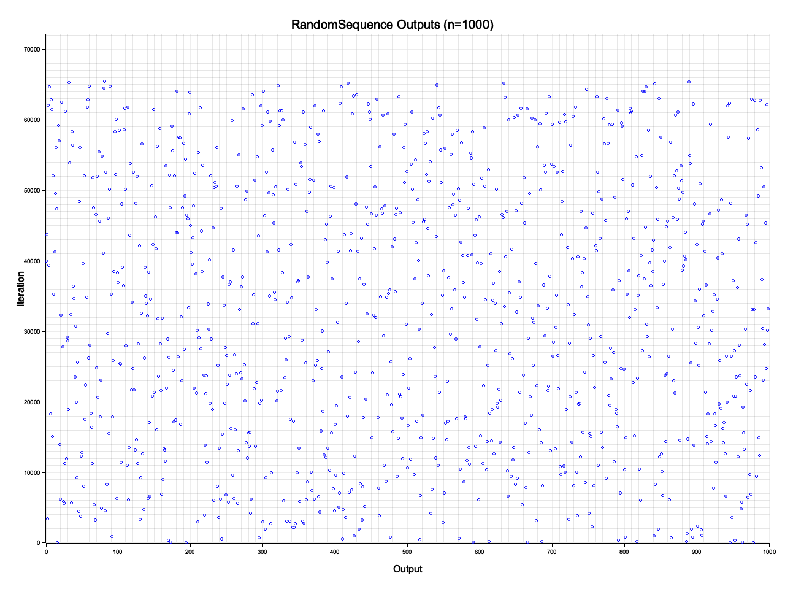

# rand-sequence

Deterministically generate a sequence of unique random numbers. A non-repeating pseudo-random number generator, directly index-able for the nth number in the sequence.

Not cryptographically secure. Complexity: O(1) time and space complexity for all operations.

Properties:
- The sequence is deterministic and repeatable for the same seeds.
- The sequence will only include each number once (every index has a unique output).
- The sequence is pseudo-uniformly distributed.
  - Each number which has not yet appeared in the sequence has a roughly equal probability of being the next number in the sequence.
  - Note that once a number has appeared in the sequence, it will not appear again. Each value in this sequence is unique.
- Computing the value for any random index in the sequence is an O(1) operation.
  - `RandomSequence::n(index)` returns the output for a given position in the sequence.
- Support for `u8`, `u16`, `u32`, and `u64`. Outputs can be cast to `i8`, `i16`, `i32`, and `i64` respectively.

## Output Distribution

Future work could include a more rigorous analysis of the output distribution. For now, the following charts demonstrate the roughly uniform distribution for `RandomSequence<u16>`.

Histogram visualisation of the `RandomSequence` output distribution.


Visual scatter plot of the `RandomSequence` output.


## Features

This crate is no-std compatible.

- `default-features`: `rand`
- `rand`: Enables the `rand(&mut RngCore)` helper methods on `RandomSequenceBuilder` and `RandomSequence` to initialize with random seeds, which requires the `rand` dependency. Can be omitted and instead manually provide seeds to the `RandomSequenceBuilder::seed()` method to instantiate.
- `serde`: Enables serde support for `RandomSequenceBuilder`, which requires the `serde` dependency.

## Example

```rust
use rand::rngs::OsRng;
use rand_sequence::{RandomSequence, RandomSequenceBuilder};

// Initialise a sequence from a random seed.
let config = RandomSequenceBuilder::<u64>::rand(&mut OsRng);
let mut sequence = config.into_iter();

// Iterate over the sequence with next() and prev(), or index directly with n(i).
assert_eq!(sequence.next(), sequence.n(0));
assert_eq!(sequence.next(), sequence.n(1));
assert_eq!(sequence.next(), sequence.n(2));

// Unique across the entire type, with support for u8, u16, u32, and u64.
let sequence = RandomSequence::<u16>::rand(&mut OsRng);
let nums: std::collections::HashSet<u16> = (0..=u16::MAX)
    .into_iter()
    .map(|i| sequence.n(i))
    .collect();
assert_eq!(nums.len(), u16::MAX as usize + 1);

// Serialise the config to reproduce is later, if the "serde" feature is enabled.
// let config = serde_json::to_string(&sequence.config).unwrap();
```

## How It Works

This non-repeating pseudo-random number generator works by creating a permutation function against the index in the sequence, herein referred to as `x`. So for any position `x` in the sequence, we want to deterministically compute a unique output number via function `n(x)`, where comparing `n(x)` and `n(x + 1)` would appear randomly generated.

For any prime number $p$ which satisfies $p  3 \mod 4$, then for any input $x$, the operation $f(x) = x^2 \mod p$ will produce a unique number for each value of $x$ where $2x < p$.

Quadratic residue tends to cluster numbers together, and so we apply the quadratic residue permutation along with other permutation functions (_wrapping_ addition and xor) to add further noise. Permutation functions are those with a direct 1-1 mapping for all inputs to outputs, where each input has a unique output.

In a simplified form, the permutation function is:
```rust
/// `p` is chosen to be the largest number satisfying:
/// - a prime number
/// - that satisfies p = 3 mod 4 (`p % 4 == 3`)
/// - that fits in the datatype chosen, in this example `u64`
const PRIME: u64 = 18446744073709551427;

/// Simplified example of the quadratic residue function, taking input `x` for prime `PRIME`.
fn permute_qpr(x: u64) -> u64 {
    // we choose x to be the largest prime number of the type, and so there are a small handful
    // of numbers in the datatype which are larger than p. We map them directly to themselves.
    if x > PRIME {
        return x;
    }

    // compute the residue, in the real method we're careful to avoid integer overflow, omitted here
    // for clarity.
    let residue = (x * x) % PRIME;

    // the residue is unique for all x <= p/2; and so p-residue is also unique for x > p/2.
    if x <= PRIME / 2 {
        residue
    } else {
        PRIME - residue
    }
}

/// Randomly selected variables to introduce further noise in the output generation.
const OFFSET_NOISE: u64 = 0x46790905682f0161;
const XOR_NOISE: u64 = 0x5bf0363546790905;

/// We can then use this permutation function [permute_qpr] to build our number generator `n(x)`.
fn n(x: u64) -> u64 {
    // function sequence: permute_qpr, wrapping addition, xor, permute_qpr
    // care is taken in the real implementation to use wrapping addition, omitted here for clarity.
    permute_qpr((permute_qpr(x) + OFFSET_NOISE) ^ XOR_NOISE)
}
```

## Sources

Based on the article by [@preshing](https://github.com/preshing) using quadratic prime residue:
- Article: http://preshing.com/20121224/how-to-generate-a-sequence-of-unique-random-integers/
- Source: https://github.com/preshing/RandomSequence/blob/master/randomsequence.h
